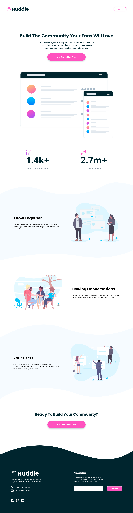

# Frontend Mentor - Huddle landing page with curved sections solution

This is a solution to the [Huddle landing page with curved sections challenge on Frontend Mentor](https://www.frontendmentor.io/challenges/huddle-landing-page-with-curved-sections-5ca5ecd01e82137ec91a50f2). 
## Table of contents

- [Overview](#overview)
  - [The challenge](#the-challenge)
  - [Screenshot](#screenshot)
  - [Links](#links)
- [My process](#my-process)
  - [Built with](#built-with)
  - [What I learned](#what-i-learned)
  - [Continued development](#continued-development)
  - [Useful resources](#useful-resources)
- [Author](#author)
- [Acknowledgments](#acknowledgments)

## Overview

### The challenge

Users should be able to:

- View the optimal layout for the site depending on their device's screen size
- See hover states for all interactive elements on the page

### Screenshot

- Solution URL: [Github](https://github.com/LuisVera1/FrontendMentor-Huddle-landing-curve-sections)
- Live Site URL: [Live Solution](https://vercel.live/link/frontend-mentor-huddle-landing-curve-sections.vercel.app?via=project-dashboard-alias-list&p=1)

## My process

### Built with

- Semantic HTML5 markup
- CSS custom properties
- BEM
- Flexbox
- [React](https://reactjs.org/) - JS library
- JavaScript

### What I learned

I learned best practices for defining and structuring larger projects.

And I also learned how to add color to an SVG 😁.

### Continued development

I'll try to make my projects faster.

## Author

- Website - [Luisvera.dev](https://www.luisvera.dev)
- Frontend Mentor -
  [@LuisVera1](https://www.frontendmentor.io/profile/LuisVera1)
